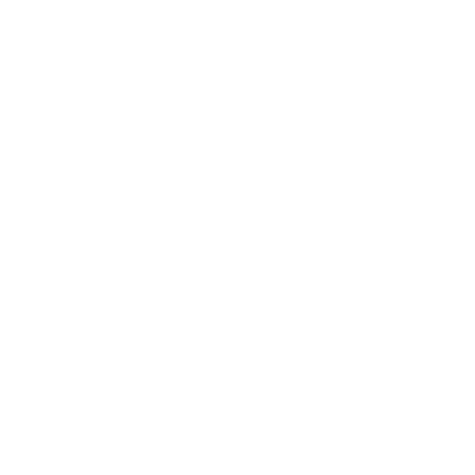
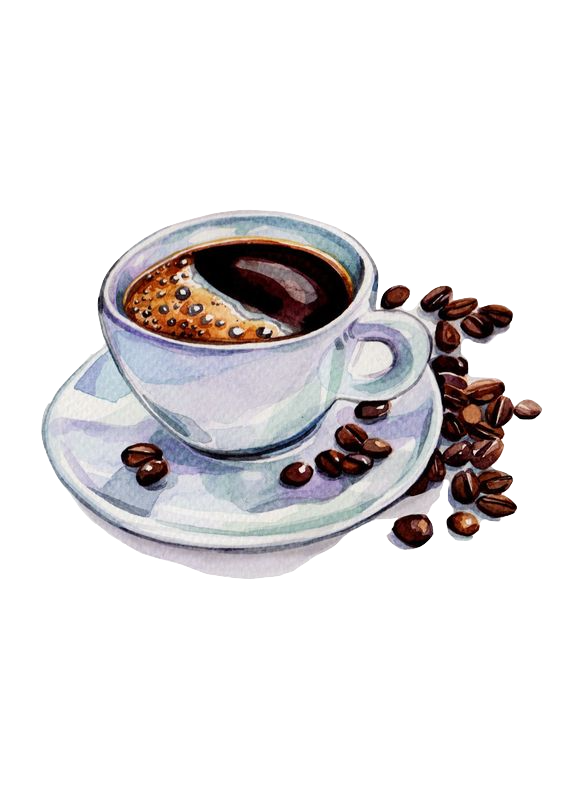

Portfolio to dos

- wakatime integration
- animations
- fancy javascript stuff
- contact
- add twitter shares and github to all projects
- deal with hosting, transfering, vs getting a new domain
- get email set up
- make dynamic nav 

index.html
<header>
		<nav class="hidden">
			<ul>
				<li>home</li>
				<li>about</li>
				<li>work</li>
				<li>contact</li>
			</ul>
		</nav>

		

			<h1>Cece</h1>
			

				
				
develop

			

			

				<h4>cece fan</h4>
				<h2>web developer</h2>
				<h4>artist</h4>				
			

			

				
				
design

			

			
<i class="fas fa-chevron-down"></i>
read more

		

	</header>
	<main>
		<section class="about wrapper">
			<h2>about me</h2>
			

				

				

					
Lorem ipsum dolor sit amet consectetur adipisicing elit. Provident praesentium quo voluptatum, est repudiandae expedita ullam dignissimos soluta ipsum enim cum ipsa asperiores. Delectus earum quibusdam eos voluptas maiores debitis. Lorem, ipsum dolor sit amet consectetur adipisicing elit. Totam laborum voluptates porro deleniti eius, officia doloremque velit dignissimos repudiandae laudantium quas aspernatur ipsa fugiat quis aliquam consectetur eum, iste tempore.

				

			</di>
		</section>
		<section class="works">
			<h2 class="wrapper">my work</h2>
			<!-- 

				

				

				

				

			
 -->
			<!-- 
showcase

			
hey im hidden
 -->
			
	
				

					<h3>tamagotchi</h3>
					
 Lorem ipsum dolor sit amet, consectetur adipisicing elit. Nam odio magni, ullam doloremque fuga nihil voluptates dolores expedita repellat, earum, harum ex laudantium dicta eligendi in quaerat dolore saepe quibusdam.

				

				

					

						
					

				

				

				

					<i class="devicon-html5-plain-wordmark"></i>
					<i class="devicon-css3-plain-wordmark"></i>
					<i class="devicon-javascript-plain"></i>
				

				

					

					

				

			

			

				

					
				

				

					<h3>work2</h3>
					
 Lorem ipsum dolor sit amet, consectetur adipisicing elit. Nam odio magni, ullam doloremque fuga nihil voluptates dolores expedita repellat, earum, harum ex laudantium dicta eligendi in quaerat dolore saepe quibusdam.

				

				

				

				

					

						
					

				

			

			

				

					<h3>work3</h3>
					
 Lorem ipsum dolor sit amet, consectetur adipisicing elit. Nam odio magni, ullam doloremque fuga nihil voluptates dolores expedita repellat, earum, harum ex laudantium dicta eligendi in quaerat dolore saepe quibusdam.

				

				

				

				

				

					

						
					

				

			

			

				

				

					<h3>work4</h3>
					
 Lorem ipsum dolor sit amet, consectetur adipisicing elit. Nam odio magni, ullam doloremque fuga nihil voluptates dolores expedita repellat, earum, harum ex laudantium dicta eligendi in quaerat dolore saepe quibusdam.

				

				

				

				

					

						
					

				

			

		</section>
		<section class="resume wrapper">
			

				
			

			<button>drink?</button>
			<button>reading material?</button>
			
			<form action="" class="form">
				<i class="far fa-times-circle"></i>
				
did somebody say coffee?

				<!--  -->
				

					<label for="first-name">First Name: </label>
					<input type="text" placeholder="First Name" required >
				

				

					<label for="last-name">Last Name: </label> 
					<input type="text" required >
				

				

					<label for="phone" >phone number: </label>
					<input type="text">
				

				

					<label for="email">email :</label> 
					<input type="text">
				

				

					<label for="title">favorite drink? :</label> 
					<input type="text">
				

				

					<label for="inquiry">message: </label>
					<textarea name="" id="" cols="30" rows="10"></textarea>
				

			</form>
		</sectio>

		<!-- <section class="wrapper">
		</section> -->
	</main>
	<footer>
		<section class="contact">
			<!-- 
contact
 -->
			
email

			
phone

			
Linkedin

			
twitter

		</section>
		<h4>cecilian fan</h4>
	</footer>

HEADER
header {
    width: 100wh;
    margin-bottom: 200px;
}

nav {
    position: fixed;
    top: 0;
    background: rgba(255, 255, 255, 0.8);
    font-family: $body;
    z-index: 10;
    width: 100vw; // width: 100vw;
    ul {
        padding: 20px;
        display: flex;
        // height: $header-height;
        align-items: center;
        justify-content: flex-end;
        li {
            margin-left: 15px;
        }
    }
}

.hero {
    // margin-top: $header-height;
    position: relative; // bottom: 0;
    width: 100vw;
    background: white;
    height: 100vh;
    display: flex;
    h1 {
        font-family: $cursive;
        // letter-spacing: 1px;
        position: absolute;
        font-size: remCalc(30);
        transform: rotate(0);
        left: 20%;
        top: 15%;
    }
    .read-more {
        position: absolute;
        right: 20%;
        bottom: 15%;
        display: flex;
        font-family: $heading;
        text-transform: capitalize;
        .fa-chevron-down {
            margin-right: 10px;
        }
    }
    .hero-left {
        background: url('../../assets/hero1.jpg') center;
        background-size: cover;
        position: absolute;
        outline: 1px solid white;
        outline-offset: -35px; 
        // border: 10px solid transparent;
        // box-shadow: inset 0px 0px 0px 1px white;
        bottom: 0;
        left: 0;
        width: 45%;
        height: 60%;
        p {
            color: white;
            font-family: $body;
            position: absolute;
            display: inline-block;
            right: 18%;
            top: 12%;
            letter-spacing: 3px;
            text-transform: capitalize;
        }
    }
    .hero-right {
        // background: lightgrey;
        background: url('../../assets/hero2.jpg') center;
        // background-attachment: fixed;
        background-size: cover;
        position: absolute;
        right: 0;
        top: 0;
        width: 45%;
        height: 60%;
        outline: 1px solid white;
        outline-offset: -35px;
         p {
            color: white;
            font-family: $body;
            position: absolute;
            display: inline-block;
            left: 18%;
            top: 12%;
            letter-spacing: 3px;
            text-transform: capitalize;
         }
    }
    .hero-middle {
        // background: 
        position: absolute;
        width: 300px;
        height: 300px;
        background: white;
        align-self: center;
        margin: 0 auto;
        left: 50%;
        transform: translateX(-50%);
        z-index: 9;
        display: flex;
        font-family: $heading;
        letter-spacing: 2px;
        justify-content: center;
        align-items: center;
        display: flex;
        flex-direction: column;
        line-height: 2;
        text-transform: capitalize;
        // text-align: justify;
        
        // &:after {
        //     content: "web developer";
        //     display: inline-block;
        //     width: 100%;
        //     font-size: remCalc(100);
        // }
        h2 {
            width: 100%;
            color: darksalmon;
            font-size: remCalc(30);
            text-align: center;
            // text-justify: inter-word;
            
        }
    }
}

credits:
 hero image Natalia Tyulkina
  Photo by Natalya Moshnina on Unsplash brush strokes
 Photo by el alce web on Unsplash - laptop with the pencils
  

   "yo my name is cece" -Noel Matta